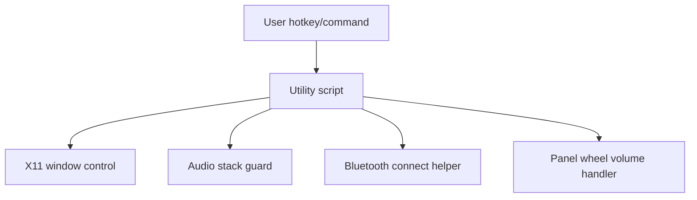
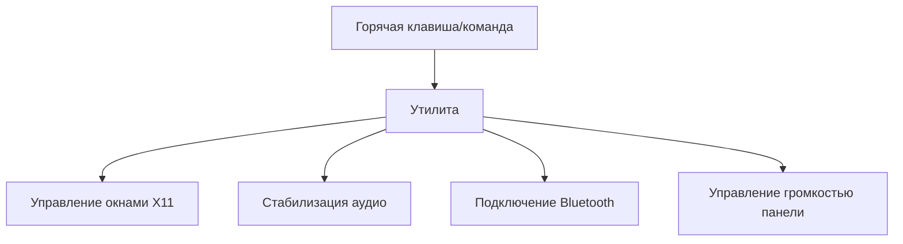

# DeskPulse

## English
## Problem
Linux desktop users often need small focused automations for window management, audio recovery, and panel-volume shortcuts.
## Solution
DeskPulse is a set of Python utilities for X11 workflows: window toggle, audio guard, Bluetooth headphones connect helper, and taskbar wheel volume control.
## Tech Stack
- Python
- Linux/X11 utilities
- PipeWire/PulseAudio/ALSA integration scripts
- BlueZ (`bluetoothctl`) for Bluetooth pairing/connection
## Architecture
```text
minimize_all.py
hide_all.py
headphones_guard.py
bt_headphones_connect.py
taskbar_volume_hover.py
toggle_taskbar_wheel_volume.py
```

## Features
- Minimize/restore window behavior
- Audio sink watchdog and recovery
- Reliable Bluetooth headphones connect with retries
- Volume control by mouse wheel on taskbar area
- Toggle script for quick on/off workflow
## How to Run
```bash
python3 minimize_all.py
python3 headphones_guard.py --watch --interval 5
./bt_headphones_connect.py
```

## Russian
## Проблема
Пользователям Linux часто нужны небольшие утилиты для управления окнами, стабилизации звука и быстрого управления громкостью.
## Решение
DeskPulse — это набор Python-скриптов для X11: переключение окон, audio watchdog, подключение BT-наушников и управление громкостью колесиком в зоне панели.
## Стек
- Python
- Linux/X11 утилиты
- Скрипты для PipeWire/PulseAudio/ALSA
- BlueZ (`bluetoothctl`) для сопряжения/подключения Bluetooth
## Архитектура
```text
minimize_all.py
hide_all.py
headphones_guard.py
bt_headphones_connect.py
taskbar_volume_hover.py
toggle_taskbar_wheel_volume.py
```

## Возможности
- Сворачивание/восстановление окон
- Watchdog аудио-выхода
- Надежное подключение Bluetooth-наушников с повторами
- Громкость колесиком мыши в зоне панели
- Быстрое переключение режима on/off
## Как запустить
```bash
python3 minimize_all.py
python3 headphones_guard.py --watch --interval 5
./bt_headphones_connect.py
```

## Важно
- В среде без X RECORD fallback-режим (`--allow-grab`) может перехватывать wheel-события у приложений.
- Если wheel в браузере перестал работать, отключите режим колесика через `toggle_taskbar_wheel_volume.py`.
- Для автозапуска стабилизации звука используется user service `headphones-guard.service`.
